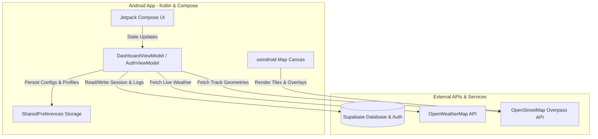

# ClearPath Nexus

ClearPath Nexus is a data-driven railway cargo clearance and corridor reliability intelligence platform. It acts as a comprehensive decision-support system designed to evaluate railway cargo route clearances, optimize freight path selection, and monitor environmental hazards. 

Built as a native Android application using **Kotlin** and **Jetpack Compose**, the app runs standalone on physical devices, communicating with a **Supabase** backend and open GIS mapping APIs.

---

## Architecture Overview

The system is decoupled into the following layers:
- **Mobile Client**: A modern, Jetpack Compose-based native Android application implementing a Bento Grid/Glassmorphism inspired design system.
- **Backend Services**: Supabase handles user authentication and persists historical route evaluation logs.
- **Mapping & GIS Engine**: Uses the `osmdroid` library to render offline/online OpenStreetMap tiles and plot custom vector overlays for routes, stations, and weather threat zones.

---

## Core Functionality & Features

### 1. User Authentication (Supabase)
- Secured via **Supabase Auth** allowing developers and operators to create accounts, log in with persistent session states, and securely sync their route evaluation histories to the cloud.
- Supports display names, secure password hashing, and user sign-out.

### 2. Configuration & Load Profiles Panel
- **Cargo Dimension Input**: Operators input the height (m), width (m), weight (tonnes), and estimated train arrival hours.
- **Station Selection**: Select corridors using standard railway station codes (e.g., NGP for Nagpur, JNPT for Jawaharlal Nehru Port Trust, BSL for Bhusaval, MMR for Manmad, KYN for Kalyan, PUNE for Pune).
- **Waypoint Stops**: Add up to 5 custom waypoints to compute complex multi-destination corridors.
- **Load Profiles**: Save frequently used cargo dimensions (e.g., *Standard Container*, *Oversized Transformer*) to local SharedPreferences. Selecting a profile instantly auto-populates the dimension fields.

### 3. Route Selection & Comparison (Full-Screen Takeover)
- Evaluates multiple alternative corridors in parallel.
- Displays key comparison metrics: distance (km), travel time (hours), and reliability score.
- Includes an interactive **Route Comparison Map** showing all potential paths mapped concurrently with weather icons at their respective mid-points.
- Calculates estimated travel times dynamically, assuming the train travels at a realistic speed range of **60–80 km/h**.

### 4. Interactive Map Visualizer
- Uses `osmdroid` for high-performance offline-capable map rendering.
- Features:
  - **Dynamic Zoom**: Automatically fits the bounding box around all path coordinates.
  - **Station Indicators**: Plots markers at each corridor waypoint.
  - **Environmental Hazards**: Draws semi-transparent colored polygons over active hazard zones (e.g., storm severity zones in red, space weather/solar Kp-index risk zones in amber).
  - **Live Weather Widgets**: Overlays floating current temperature, wind speed, and humidity widgets for the selected route.

### 5. Telemetry & Load Profile Customization
- The **Telemetry Panel** adapts its layout and cargo details based on the selected Load Profile:
  - Displays compartment count, axle load per compartment pair, and cargo purpose.
  - Compares cargo envelope metrics against track clearance guidelines to show a dynamic status badge (**SAFE** or **CHECK REQUIRED**).
- Displays individual breakdown scores for the selected corridor.

### 6. Dynamic Threat Simulator
- Simulates real-world railway hazards using interactive sliders:
  - **Storm Severity** (0 to 10)
  - **Solar Kp Index** (0 to 9)
  - **Port Congestion** (0% to 100%)
- Computes real-time hazard impacts on the route reliability index and appends warnings to a live scrolling simulation alert log.

---

## Calculations & Formulas

### 1. Route Reliability Index ($R$)
The system calculates a weighted reliability score (from 0 to 100) combining weather conditions, port delays, congestion levels, and historical track performance:

\[R = (0.40 \times \text{Weather}) + (0.40 \times \text{Port}) + (0.10 \times \text{Congestion}) + (0.10 \times \text{Historical})\]

*Note: If the physical dimensions of the cargo exceed the maximum clearance envelope of a critical segment, the status is marked as `HARD_BLOCKED` and the reliability index drops to `0%`.*

### 2. Time Estimation
Travel times are estimated using track lengths and a train speed heuristic:
- Train speed is randomized between **60 and 80 km/h** to simulate dynamic freight traffic.
- Each additional stop or waypoint adds a flat **0.5-hour delay** to account for switching and loading.

---

## App Lifecycle & State Persistence

To ensure the application functions reliably on physical devices under resource constraints:
1. **MapView Lifecycle Alignment**: Both `RouteMapView` and `RouteComparisonMap` register Composition lifecycle observers (`LifecycleEventObserver`) that map to the Android Activity's `onResume()`, `onPause()`, and `onDetach()` events. This prevents map thread leaks, reduces background power usage, and ensures map rendering resumes instantly when the app is reopened.
2. **Persistent SharedPreferences Cache**: A reactive `LaunchedEffect` monitors configuration states (height, width, weight, stations, stops, selected profile). Changes are serialized to JSON and persisted immediately to local storage. If the Android OS terminates the background process, the app automatically recovers all input values when restarted.
3. **Smart Back Navigation**: Back navigation handlers (`BackHandler`) intercept system back buttons:
   - When viewing alternative routes on the `RouteSelectionScreen`, pressing back returns to the `Configure` tab.
   - When on any secondary dashboard tab (Map, Telemetry, Loads, User), pressing back returns to the primary `Configure` tab instead of closing the application.

---

## Tech Stack

- **Framework**: Android SDK (API 26+)
- **Language**: Kotlin
- **UI Toolkit**: Jetpack Compose (Material 3)
- **Networking**: Supabase Kotlin SDK, Ktor HTTP Client
- **Serialization**: Kotlinx Serialization (JSON)
- **GIS Mapping**: osmdroid-android SDK
- **Architecture**: MVVM (Model-View-ViewModel)

---

## Setup & Running the App

1. **Prerequisites**:
   - Install [Android Studio Ladybug (2024.2.1)](https://developer.android.com/studio) or newer.
   - Install Android SDK 34.
2. **Open the Project**:
   - Open Android Studio.
   - Select **Open Project** and choose the `android` folder in this repository.
3. **Configure API Keys**:
   - Ensure the app is connected to the internet.
   - The Supabase client is pre-configured to a demo project in `SupabaseClient.kt`.
4. **Deploy to a Device**:
   - Connect a physical Android device via USB.
   - Enable **USB Debugging** in your device's Developer Options.
   - Select your physical device in the device dropdown in Android Studio.
   - Click **Run** (Green Play Button).

---

## License

This project is licensed under the MIT License - see the [LICENSE](LICENSE) file for details.
